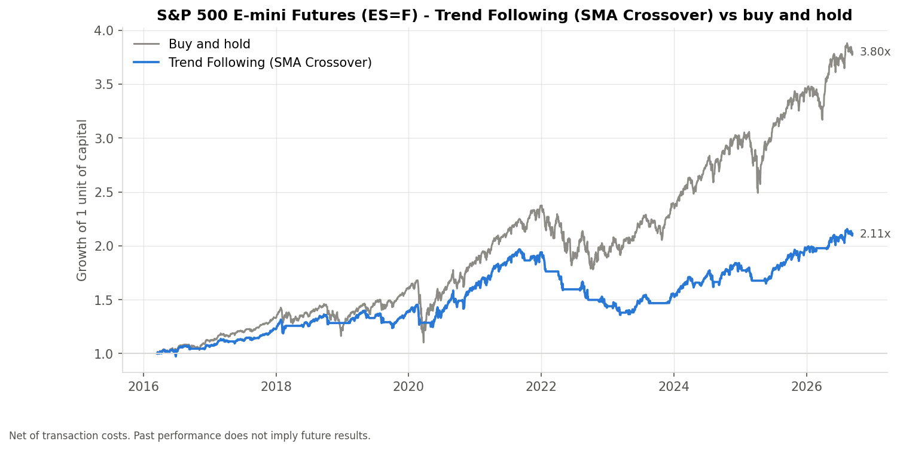
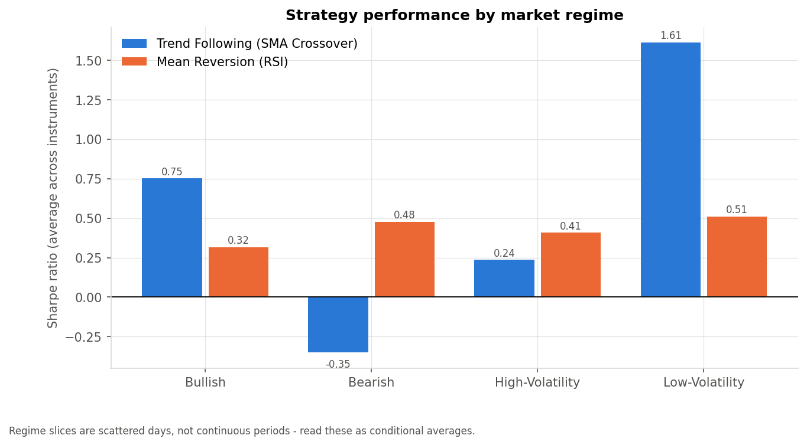
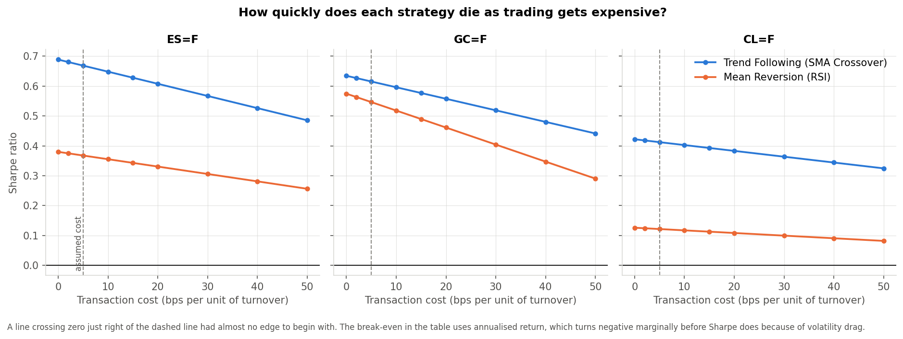
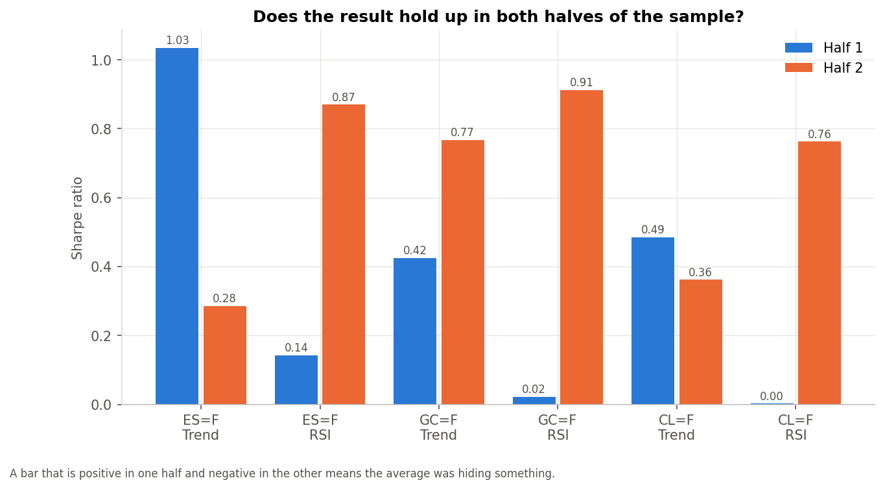

# Futures Market Strategy Backtesting

An end-to-end Python research pipeline for testing trend-following and mean-reversion strategies on S&P 500 E-mini, gold, and crude oil futures.

The project downloads and validates market data, calculates technical indicators from their definitions, runs backtests with transaction costs and look-ahead controls, and produces risk, regime, event-study, and robustness analysis.

> **Research and education only.** This project is not investment advice. Historical results do not imply future performance and should not be used to trade real money.

## Results at a glance

The included study uses daily data from 2016-01-04 to 2026-09-11 and charges 5 basis points per unit of turnover.

| Market | Trend following | RSI mean reversion | Buy and hold |
| --- | ---: | ---: | ---: |
| ES=F, S&P 500 E-mini | 7.4% p.a. / 0.67 Sharpe | 3.5% p.a. / 0.37 Sharpe | **13.6% p.a. / 0.80 Sharpe** |
| GC=F, Gold | 7.8% p.a. / 0.62 Sharpe | 2.5% p.a. / 0.55 Sharpe | **13.0% p.a. / 0.81 Sharpe** |
| CL=F, Crude oil | 7.9% p.a. / 0.41 Sharpe | -1.6% p.a. / 0.12 Sharpe | **10.2% p.a. / 0.45 Sharpe** |

Neither strategy beat buy and hold in this sample. The strategies did, however, reduce exposure and drawdown in several cases. The analysis also shows that performance depends heavily on market regime: trend following worked best in bullish and low-volatility conditions, while RSI mean reversion was more stable but weaker overall.

## What the project does

- Analyses three liquid futures markets with different drivers: equity index, precious metals, and energy.
- Computes ten indicators from first principles: returns, log returns, moving averages, volatility, RSI, momentum, drawdown, and volume statistics.
- Tests two transparent rules:
  - **SMA trend following:** long when SMA20 is above SMA50; otherwise flat.
  - **RSI mean reversion:** enter long below RSI 30 and exit above RSI 50.
- Applies the previous day's signal to each day's return to prevent look-ahead bias.
- Charges transaction costs on every position change and compares results with buy and hold.
- Reports annualized return and volatility, Sharpe and Sortino ratios, maximum drawdown, Calmar ratio, win rate, profit factor, trade count, and time in market.
- Breaks results down by trend and volatility regimes.
- Runs an FOMC event study on ES and gold, plus a price-based volatility-event study.
- Tests robustness with transaction-cost sensitivity, break-even costs, and split-sample consistency.

## Example charts









## Data

Two free daily data sources are supported:

| Source | Tickers | Requirement |
| --- | --- | --- |
| Yahoo Finance (default) | `ES=F`, `GC=F`, `CL=F` | `yfinance` |
| Stooq | `es.f`, `gc.f`, `cl.f` | No additional package or API key |

The Yahoo symbols represent continuous front-month series. Roll effects are not fully modelled, so the results should be treated as a research exercise rather than an execution-ready strategy. Raw and processed data are generated locally and ignored by Git.

## Installation

### Windows

Double-click `run.bat`. It creates a virtual environment, installs dependencies, runs the sanity checks, and starts the study.

### Any platform

```bash
git clone <your-repository-url>
cd futures-market-strategy-backtesting

python -m venv .venv
# Windows PowerShell
.venv\Scripts\Activate.ps1
# macOS/Linux
# source .venv/bin/activate

python -m pip install -r requirements.txt
```

Python 3.9 or newer is recommended.

## Usage

Run the full pipeline:

```bash
python main.py
```

Useful options:

```bash
python main.py --source stooq                       # use the alternate data provider
python main.py --use-cache                          # reuse downloaded raw data
python main.py --offline                            # synthetic data smoke test only
python main.py --start 2018-01-01 --end 2024-12-31  # choose a sample window
python main.py --cost 0.001                         # use 0.10% transaction cost
python main.py --tickers "ES=F,GC=F"                # analyse a subset of markets
python main.py --allow-short                        # enable short positions
```

Run the validation checks before trusting a result:

```bash
python tests/test_sanity.py
```

The `--offline` option generates synthetic data for testing the pipeline only. Its results are not meaningful market results.

## Project structure

```text
futures-market-strategy-backtesting/
├── data/
│   ├── raw/                    # downloaded data, ignored by Git
│   ├── processed/              # cleaned data and indicators, ignored by Git
│   └── reference/              # versioned FOMC dates
├── docs/                       # charts embedded in this README
├── outputs/
│   ├── plots/                  # generated charts, ignored by Git
│   └── results/                # generated CSV and Excel reports, ignored by Git
├── src/
│   ├── data_loader.py          # download and clean market data
│   ├── indicators.py           # indicator calculations
│   ├── strategies.py           # trading signals
│   ├── backtester.py           # backtest engine and trade extraction
│   ├── risk_metrics.py         # performance and risk metrics
│   ├── regime_analysis.py      # conditional performance
│   ├── event_study.py          # FOMC and volatility events
│   ├── robustness.py           # cost and split-sample checks
│   └── visualization.py        # charts
├── tests/test_sanity.py        # look-ahead and known-answer checks
├── main.py                     # configuration and pipeline orchestration
├── requirements.txt
└── LICENSE
```

## Generated outputs

Results are written to `outputs/results/`:

- `strategy_summary.csv`: strategy and buy-and-hold performance metrics.
- `trade_summary.csv`: completed trade details.
- `regime_analysis.csv`: performance by market regime.
- `event_study.csv` and `event_study_detail.csv`: event-study summaries and observations.
- `cost_sensitivity.csv` and `break_even_cost.csv`: transaction-cost robustness checks.
- `split_sample.csv` and `split_sample_verdict.csv`: first-half versus second-half results.
- `final_report.xlsx`: multi-sheet version of the main results and assumptions.

Charts are written to `outputs/plots/`, and `outputs/run_log.txt` stores the terminal output from the latest run.

## Key assumptions and limitations

- Signals are generated from daily closing data and applied from the following day.
- The default cost is 0.05% per unit of turnover; slippage and exchange-specific fees are simplified.
- Positions use a constant notional with no leverage or volatility targeting.
- Continuous front-month roll costs and contract-specific execution are not modelled.
- Daily bars cannot show intraday reactions, overnight paths, or the exact timing of an FOMC announcement.
- The sample covers three selected markets and one historical period; it is not evidence that the rules will work in other markets or periods.
- Negative crude oil settlement prices are removed because percentage and log returns are undefined there. The surrounding positive-price move is retained and flagged as a price break.

## License

This project is licensed under the [MIT License](LICENSE).

## Author

Created by Azen Tashis as a research and portfolio project focused on systematic trading, futures markets, and risk analysis.
